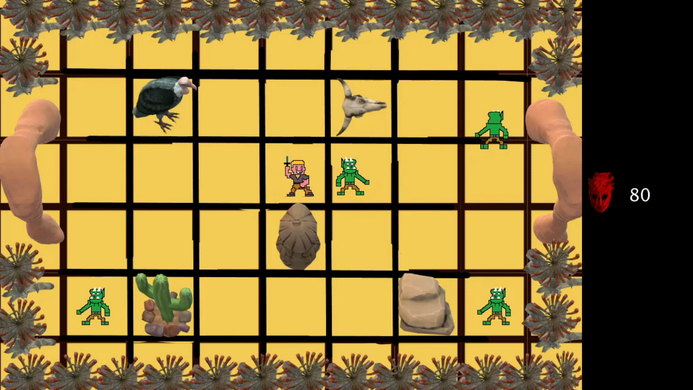

The Dark Mystery Dungeon
================

Este es un proyecto colaborativo hecho por un grupo de compañeros para la Universidad Industrial de Santander.

** La caverna oscura Vignory, la cual esta habitada por orcos, con un ambiente poco comun que no es de este mundo, en el cual la realidad esta alterada. Alli se adentra un joven aventurero que busca el misterio que se encuentra en esta cueva. **

## HISTORIA

### MENU PRINCIPAL

### AUTORES

- GUSTAVO DUARTE 
- LUIS MARTINEZ

## CAPTURA

## REQUISITOS

- Libreria Minim.

### CARACTERISTICAS
----
- Los controles del juego son las flechas del teclado y la tecla "A" para atacar.
- El jugador debera pasar entre una patrulla de orcos que estaran hubicados en diferentes salas, podras esquivarlos o matarlos pero si estos te llegan a golpear perderas mucha vida.
- En la sala se encuentran obstaculos ubicados de forma que te sea dificil pasar de sala en sala.
- Es un juego de clasificacion E+10, lo que indica que es un juego para mayores de 10 años, contiene animaciones, fantasía y violencia leve.

## CREDITOS
- Patrick de Arteaga por la música
https://patrickdearteaga.com/es/musica-libre-derechos-gratis/ link de su pg web para que la puedan revisar, tiene un material de musica muy interesante.

